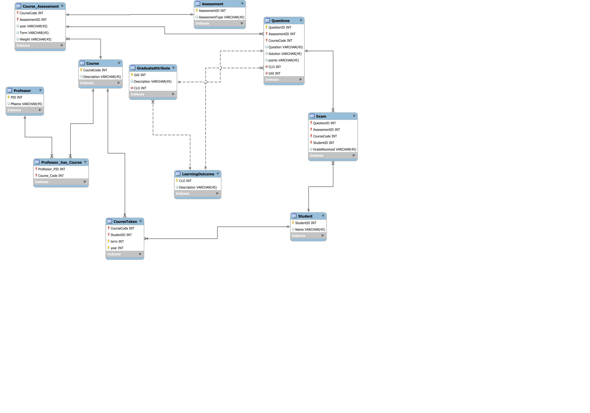

# Course Assessment Analytics

## Project Overview

We are designing a database that serves as a repository for questions used in university courses. The goal is to analyze if the learning objectives of these courses have been met. The following provides an overview of the project's business rules:

- At the university, professors teach a variety of courses, and based on the nature of the course, each professor chooses a different combination of assessment types. These assessment types include exams, projects, assignments, quizzes, presentations, and more.

- Each professor may use a unique combination of assessments for each course they teach. For example, for a course like "Introduction to Database Systems," in-class activities, written exams, projects, and presentations are used for assessment, while no popup quizzes are employed.

- Assessments are assigned weights by professors. Some assessments have multiple questions, each with its own point values. Some assessments also have sample solutions.

- Each question in an assessment is associated with a learning objective, and these objectives are categorized into six levels: Knowledge, Comprehension, Application, Analysis, Synthesis, and Evaluation. Each level has subcategories called Graduate Attribute Indicators (GAI).

- Professors aim to ensure comprehensive assessment, covering all GAIs with at least one question/assessment and testing all learning outcomes with two questions during the term.

With the queries on this repository, we can answer various questions such as:

- What percentage of students passed a specific course.
- What percentage of the assessment for course X meets the first learning outcome.
- What types of assessments have been offered by course X in a specific year and term.

Feel free to explore our project and its database to gain insights into course assessments and learning outcomes.

